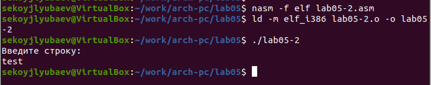
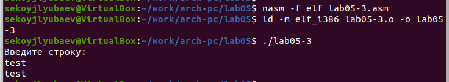

---
## Front matter
title: "Отчёт по лабораторной работе №5"
subtitle: "Архитектура компьютера"
author: "Койлюбаев Сыймык Эркинович"

## Generic otions
lang: ru-RU
toc-title: "Содержание"

## Bibliography
bibliography: bib/cite.bib
csl: pandoc/csl/gost-r-7-0-5-2008-numeric.csl

## Pdf output format
toc: true # Table of contents
toc-depth: 2
lof: true # List of figures
lot: true # List of tables
fontsize: 12pt
linestretch: 1.5
papersize: a4
documentclass: scrreprt
## I18n polyglossia
polyglossia-lang:
  name: russian
  options:
	- spelling=modern
	- babelshorthands=true
polyglossia-otherlangs:
  name: english
## I18n babel
babel-lang: russian
babel-otherlangs: english
## Fonts
mainfont: PT Serif
romanfont: PT Serif
sansfont: PT Sans
monofont: PT Mono
mainfontoptions: Ligatures=TeX
romanfontoptions: Ligatures=TeX
sansfontoptions: Ligatures=TeX,Scale=MatchLowercase
monofontoptions: Scale=MatchLowercase,Scale=0.9
## Biblatex
biblatex: true
biblio-style: "gost-numeric"
biblatexoptions:
  - parentracker=true
  - backend=biber
  - hyperref=auto
  - language=auto
  - autolang=other*
  - citestyle=gost-numeric
## Pandoc-crossref LaTeX customization
figureTitle: "Рис."
tableTitle: "Таблица"
listingTitle: "Листинг"
lofTitle: "Список иллюстраций"
lotTitle: "Список таблиц"
lolTitle: "Листинги"
## Misc options
indent: true
header-includes:
  - \usepackage{indentfirst}
  - \usepackage{float} # keep figures where there are in the text
  - \floatplacement{figure}{H} # keep figures where there are in the text
---

# Цель работы

Целью работы является приобретение практических навыков работы в Midnight Commander. 
Освоение инструкций языка ассемблера mov и int.

# Выполнение лабораторной работы

Я запустил файловый менеджер Midnight Commander, переместился в директорию ~/work/arch-pc с помощью стрелок и клавиши ввода, после чего нажатием F7 создал папку lab05.

{ #fig:001 width=70%, height=70% }

{ #fig:002 width=70%, height=70% }

Затем, используя команду touch, я создал файл lab05-1.asm.

{ #fig:003 width=70%, height=70% }

Для редактирования файла я активировал редактор mceditor, нажав F4, и приступил к написанию кода, который соответствовал поставленной задаче.

{ #fig:004 width=70%, height=70% }

Для проверки содержимого файла на наличие введенного кода я воспользовался просмотрщиком, вызванным клавишей F3.

{ #fig:005 width=70%, height=70% }

Я осуществил компиляцию написанной программы, преобразовав исходный код в объектный файл и собрав исполняемый файл, чтобы проверить ее функциональность.
 
{ #fig:006 width=70%, height=70% }

Загрузил файл in_out.asm и поместил его в текущий рабочий каталог.

{ #fig:007 width=70%, height=70% }

Используя клавишу F5, я скопировал код из файла lab05-1.asm в новый файл lab05-2.asm.

{ #fig:008 width=70%, height=70% }

После этого я дописал код в файле lab05-2.asm, включив использование подпрограмм из файла in_out.asm, скомпилировал и запустил программу для проверки.

{ #fig:009 width=70%, height=70% }

{ #fig:010 width=70%, height=70% }

В файле lab05-2.asm я заменил подпрограмму sprintLF на sprint, что после перекомпиляции привело к отсутствию перевода строки после вывода текста.

{ #fig:011 width=70%, height=70% }

{ #fig:012 width=70%, height=70% }

##  Задание для самостоятельной работы

Я скопировал исходный код из файла lab05-1.asm и модифицировал его таким образом, чтобы программа запрашивала ввод строки с клавиатуры, затем отображала эту строку на экране.

{ #fig:013 width=70%, height=70% }

{ #fig:014 width=70%, height=70% }

Также я скопировал код из файла lab05-2.asm и внес в него изменения, но на этот раз я использовал подпрограммы из файла in_out.asm для реализации алгоритма.

{ #fig:015 width=70%, height=70% }

{ #fig:016 width=70%, height=70% }

# Выводы

Научились писать базовые ассемблерные программы. Освоили ассемблерные инструкции mov и int.